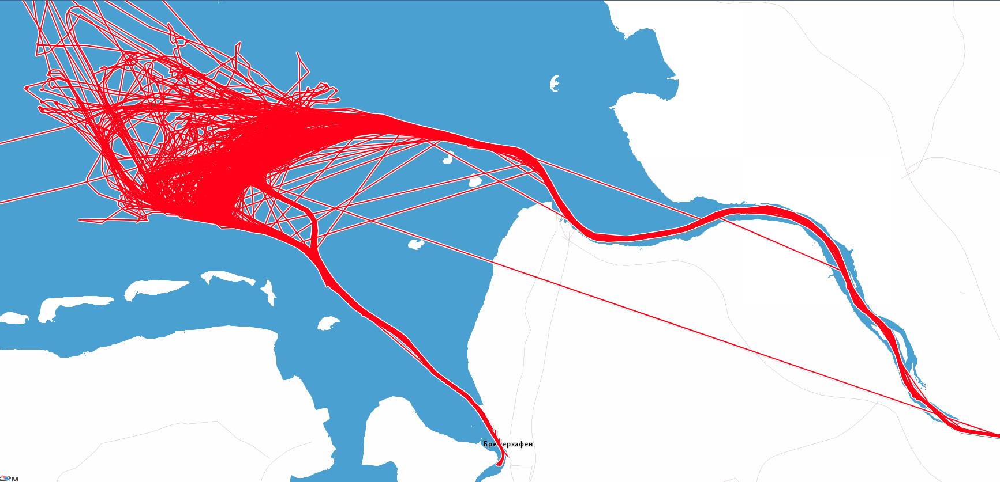
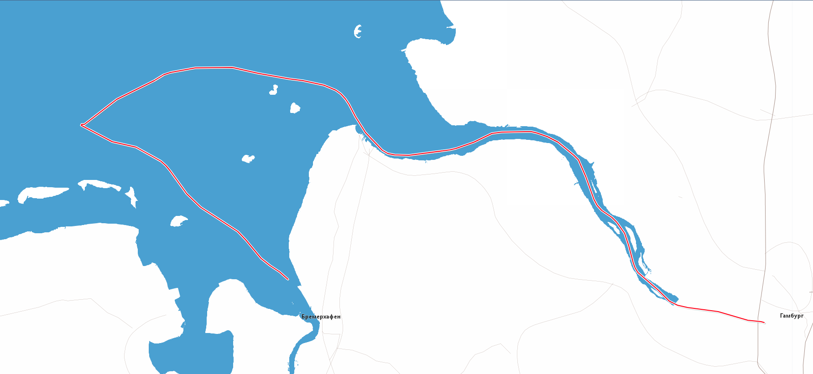

# GPS track processor
Program for searching the best representative track from a list.
The original list of track could contain wrong data ("noise") or non-optimal route.

### Dependencies
Java 11+

Maven 3.6.0+

Lombok plugin for IDE

### Using

`mvn spring-boot:run -Dspring-boot.run.arguments="<Source port> <Destination port> <Input file> <Output file>"`

For example:

`mvn spring-boot:run -Dspring-boot.run.arguments="'DEBRV' 'DEHAM' 'routes.csv' 'result.csv'"`

**The original data with "noise"**

**The most representative track after processing**
